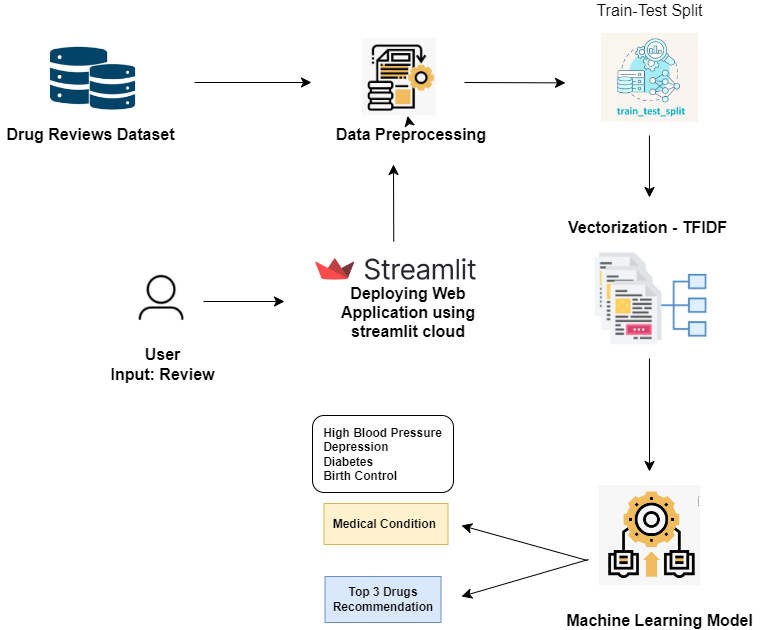

# Patient Condition Classification from Drug Reviews

## Architecture Diagram

Below is the architecture diagram of the NLP-based drug review classification system:

## Project Overview
In this project, we developed a natural language processing (NLP) system to classify patient conditions based on drug reviews. The goal is to analyze patient reviews to predict their conditions and recommend suitable drugs. The primary conditions targeted are Birth Control, Depression, High Blood Pressure, and Diabetes.

## Dataset
- **Dataset**: [Drug Review Dataset](https://archive.ics.uci.edu/dataset/462/drug+review+dataset+drugs+com)
  - Contains patient reviews categorized into various conditions.

## Methodology

### Data Collection
- **Selected Conditions**: Birth Control, Depression, High Blood Pressure, Diabetes.

### Text Vectorization
1. **Bag of Words Model**:
   - Achieved an initial accuracy of 97% using the Bag of Words model with a Multinomial Naive Bayes classifier.

2. **TF-IDF Vectorization**:
   - Improved performance with TF-IDF vectorization, but accuracy decreased initially.
   - **Model**: Passive Aggressive Classifier.
   - **Accuracy**: Increased to 98.20% using TF-IDF vectorization.

3. **TF-IDF with Bigrams**:
   - Incorporated bigram analysis (two-word pairs) to enhance feature extraction.
   - **Accuracy**: Achieved 98.6%, demonstrating significant improvement in classification accuracy.

### Model Performance
- **Passive Aggressive Classifier** with TF-IDF and bigrams demonstrated the highest accuracy of 98.6%.
- **Confusion Matrix Analysis**:
  - Birth Control had the highest number of predictions, reflecting its prevalence in the dataset.
  - Misclassifications were observed, such as some cases of Depression being predicted as Birth Control.

### Deployment
- **Streamlit**: Deployed the model using Streamlit for interactive user interface and accessibility.
- **Model Serialization**:
  - **Joblib**: Serialized the model and vectorizer for efficient deployment and integration across platforms, including web and mobile applications.

## Conclusion
The project successfully demonstrated the application of advanced text feature extraction techniques in classifying patient conditions from drug reviews. The integration of TF-IDF with bigram analysis and the deployment of the model using Streamlit offer a robust solution for recommending suitable drugs based on patient reviews.

## Future Work
- Explore additional feature extraction methods.
- Improve model generalization to handle more diverse datasets.
- Enhance deployment capabilities for broader accessibility and integration.
